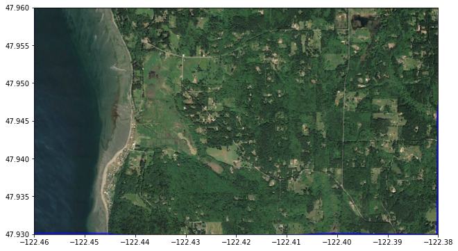
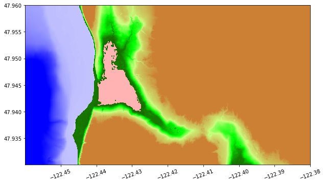
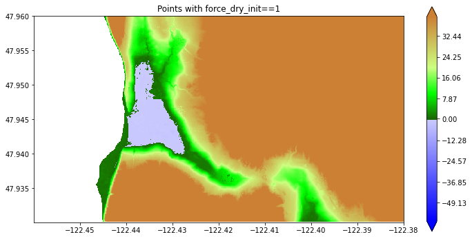
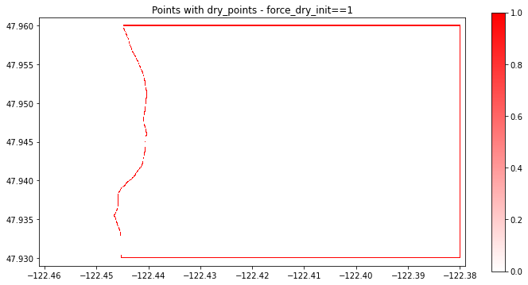

.. _force_dry:

Force Cells to be Dry Initially
===============================

**New in Version 5.7.0.**

Adapted from `this notebook
<http://www.clawpack.org/new_features_for_v5.7.0/notebooks_html/ForceDry.html>`_
from a `collection illustrating new features for v5.7.0
<http://www.clawpack.org/new_features_for_v5.7.0/>`_.

See also :ref:`marching_front`, which describes a
tool to select points from a topography DEM that satisfy given
constraints on elevation, and how this can be used to determine dry land
behind dikes.

This can then be used to define an array
that can be read into GeoClaw and used when initializing the water depth
during the creation of new grid patches.
See the section `Usage in GeoClaw Fortran code <#fdry-geoclaw>`__
for instructions on how to specify this in `setrun.py`.

We define an rectangular array `force_dry_init` that is aligned with
cell centers of the computational grid at some resolution (typically the
finest resolution) and that has the value `force_dry_init[i,j] = 1` to
indicate cells that should be initialized to dry (`h[i,j] = 0`)
regardless of the value of the GeoClaw topography `B[i,j]` in this
cell. If `force_dry_init[i,j] = 0` the the cell is initialized in the
usual manner, which generally means

`h[i,j] = max(0, sea_level - B[i,j])`.

Notes:

-  Another new feature allows initializing the depth so that the surface
   elevation `eta` is spatially varying rather than using a single
   scalar value `sea_level` everywhere. That feature is described in
   :ref:`set_eta_init`.  If that is used in
   conjunction with a `force_dry_init` array,
   `force_dry_init[i,j] = 1` still indicates that the cell should be
   dry while elsewhere the “usual” thing is done.

-  The current implementation allows only one `force_dry_init` array
   but in the future this may be generalized to allow multiple arrays
   covering different subsets of the domain, and perhaps at different grid
   resolutions.

-  Typically the `force_dry_init` array is computed from a DEM file at
   the desired resolution, using the marching front algorithm defined in
   :ref:`marching_front`.  But recall that the
   GeoClaw topography value `B[i,j]` does not agree with the DEM value
   `Z[i,j]` even if the cell center is aligned with the DEM point due
   to the way `B` is computed by averaging over piecewise bilinear
   functions that interpolate the `Z` values. So one has to be careful
   not to set `force_dry_init[i,j] = 1` in a cell close to the shore
   simply because `Z > 0` at this point since the `B` value might be
   negative in the cell. This is dealt with in the examples below by
   doing some buffering.

Contents
---------

-  `Sample topography from a 1/3 arcsecond DEM <#fdry-topo>`__
-  `Creating the force_dry_init array <#fdry-init>`__
-  `Create file to read into GeoClaw <#fdry-file>`__
-  `Usage in GeoClaw Fortran code <#fdry-geoclaw>`__

Examples
--------

First import some needed modules and set up color maps.

.. code:: ipython3

    %matplotlib inline

.. code:: ipython3

    from pylab import *
    import os,sys
    from numpy import ma # masked arrays
    from clawpack.visclaw import colormaps

    from clawpack.geoclaw import marching_front, topotools
    from clawpack.amrclaw import region_tools
    from clawpack.visclaw import plottools

.. code:: ipython3

    zmin = -60.
    zmax = 40.
    
    land_cmap = colormaps.make_colormap({ 0.0:[0.1,0.4,0.0],
                                         0.25:[0.0,1.0,0.0],
                                          0.5:[0.8,1.0,0.5],
                                          1.0:[0.8,0.5,0.2]})
    
    sea_cmap = colormaps.make_colormap({ 0.0:[0,0,1], 1.:[.8,.8,1]})
    
    cmap, norm = colormaps.add_colormaps((land_cmap, sea_cmap),
                                         data_limits=(zmin,zmax),
                                         data_break=0.)
                                         
    sea_cmap_dry = colormaps.make_colormap({ 0.0:[1.0,0.7,0.7], 1.:[1.0,0.7,0.7]})
    cmap_dry, norm_dry = colormaps.add_colormaps((land_cmap, sea_cmap_dry),
                                         data_limits=(zmin,zmax),
                                         data_break=0.)

.. _fdry-topo:

Sample topography from a 1/3 arcsecond DEM
------------------------------------------

We consider a small region on the SW coast of Whidbey Island north of
Maxwelton Beach as an example, as was used in
`MarchingFront.ipynb <MarchingFront.ipynb>`__.

.. code:: ipython3

    region1_png = imread('region1.png')
    extent = [-122.46, -122.38, 47.93, 47.96]
    
    figure(figsize=(12,6))
    imshow(region1_png, extent=extent)
    gca().set_aspect(1./cos(48*pi/180.))

We read this small portion of the 1/3 arcsecond Puget Sound DEM,
available from the NCEI thredds server:

.. code:: ipython3

    path = 'https://www.ngdc.noaa.gov/thredds/dodsC/regional/puget_sound_13_mhw_2014.nc'
    topo = topotools.read_netcdf(path, extent=extent)

Plot the topo we downloaded:

.. code:: ipython3

    figure(figsize=(12,6))
    plottools.pcolorcells(topo.X, topo.Y, topo.Z, cmap=cmap, norm=norm)
    colorbar(extend='both')
    gca().set_aspect(1./cos(48*pi/180.))

.. image:: ForceDry/output_13_0.png

This plot shows that there is a region with elevation below MHW (0 in
the DEM) where the Google Earth image shows wetland that should not be
initialized as a lake. We repeat the code used in :ref:`marching_front`
to identify dry land below MHW:

.. code:: ipython3

    wet_points = marching_front.select_by_flooding(topo.Z, Z1=-5., Z2=0., max_iters=None)
    
    Zdry = ma.masked_array(topo.Z, wet_points)
    
    figure(figsize=(12,6))
    plottools.pcolorcells(topo.X, topo.Y, Zdry, cmap=cmap, norm=norm)
    colorbar(extend='both')
    gca().set_aspect(1./cos(48*pi/180.))
    title('Dry land');

.. parsed-literal::

    Selecting points with Z1 = -5, Z2 = 0, max_iters=279936
    Done after 112 iterations with 59775 points chosen

.. image:: ForceDry/output_15_2.png

Now the blue region above is properly identified as being dry land.

The colors are misleading, so here’s a way to plot with the dry land
that is below MHW colored pink to distinguish it from the water better:

.. code:: ipython3

    # Create a version of topo.Z with all wet points masked out:
    mask_dry = logical_not(wet_points)
    Z_dry = ma.masked_array(topo.Z, wet_points) 
    
    # Create a version of topo.Z with only dry points below MHW masked out:
    mask_dry_onshore = logical_and(mask_dry, topo.Z<0.)
    Z_allow_wet= ma.masked_array(topo.Z, mask_dry_onshore)
    
    figure(figsize=(10,12))
    
    # first plot all dry points as pink:
    plottools.pcolorcells(topo.X, topo.Y, Z_dry, cmap=cmap_dry, norm=norm_dry)
    
    # then plot colored by topography except at dry points below MHW:
    plottools.pcolorcells(topo.X, topo.Y, Z_allow_wet, cmap=cmap, norm=norm)
    
    gca().set_aspect(1./cos(48*pi/180.))
    ticklabel_format(useOffset=False)
    xticks(rotation=20);

.. _fdry-init:

Creating the `force_dry_init` array
-------------------------------------

The array `wet_points` generated above has the value 1 at DEM points
identified as wet and 0 at points identified as dry, so if we set

.. code:: ipython3

    dry_points = 1 - wet_points

then `dry_points[i,j] = 1` at the DEM points determined to be dry. We
do not necessarily want to force the GeoClaw cell to be dry however at
all these dry points, because the GeoClaw topography value `B` may be
slightly negative even if the DEM value `Z` was positive at the same
point, due to the way `B` is computed, and so this might force some
cells near the shore to have `h = 0` even though `B < 0`.

Instead we will set `force_dry_init[i,j] = 1` only if
`dry_points[i,j] = 1` and the same is true of all its 8 nearest
neighbors. This avoids problems near the proper shoreline while forcing
cells inland to be dry where they should be.

We also assume it is fine to set `force_dry_init[i,j] = 0` around the
boundary of the grid on which `dry_points` has been defined, so that
the usual GeoClaw procedure is used to initialize these points. If there
are points at the boundary that must be forced to be dry that we should
have started with a large grid patch.

So we can accomplish this by summing the `dry_points` array over 3x3
blocks and setting `force_dry_init[i,j] = 1` only at points where this
sum is 9:

.. code:: ipython3

    dry_points_sum = dry_points[1:-1,1:-1] + dry_points[0:-2,1:-1] + dry_points[2:,1:-1] + \
                     dry_points[1:-1,0:-2] + dry_points[0:-2,0:-2] + dry_points[2:,0:-2] + \
                     dry_points[1:-1,2:] + dry_points[0:-2,2:] + dry_points[2:,2:]
            
    # initialize array to 0 everywhere:
    force_dry_init = zeros(dry_points.shape)
    # reset in interior to 1 if all points in the 3x3 block around it are dry:
    force_dry_init[1:-1,1:-1] = where(dry_points_sum == 9, 1, 0)

If we use `1-force_dry_init` as a mask then we see only the points
forced to be dry:

.. code:: ipython3

    Zdry = ma.masked_array(topo.Z, 1-force_dry_init)
    
    figure(figsize=(12,6))
    plottools.pcolorcells(topo.X, topo.Y, Zdry, cmap=cmap, norm=norm)
    colorbar(extend='both')
    gca().set_aspect(1./cos(48*pi/180.))
    title('Points with force_dry_init==1')

This looks a lot like the plot above where we masked with
`wet_points`. However, if we plot `dry_points - force_dry_init` we
see that this is not identically zero – and there are points along the
shore and the boundaries where the point was identified as dry but will
not be forced to be dry:

.. code:: ipython3

    figure(figsize=(12,6))
    plottools.pcolorcells(topo.X, topo.Y, dry_points - force_dry_init, 
                          cmap=colormaps.white_red)
    colorbar()
    gca().set_aspect(1./cos(48*pi/180.))
    axis([-122.461, -122.379, 47.929, 47.961]) # expanded domain
    title('Points with dry_points - force_dry_init==1');

.. _fdry-file:

Create file to read into GeoClaw
--------------------------------

The array `force_dry_init` can now be saved in the same format as topo
files, using `topo_type=3` and specifying `Z_format='%1i'` so that
the data values from the array, which are all either 0 or 1, are printed
as single digits to help reduce the file size.

Note we also use the new convenience fuction `set_xyZ` introduced in
`topotools.Topography`.

.. code:: ipython3

    force_dry_init_topo = topotools.Topography()
    force_dry_init_topo.set_xyZ(topo.x, topo.y, force_dry_init)
    
    # Old way of setting x,y,Z:
    #force_dry_init_topo._x = topo.x
    #force_dry_init_topo._y = topo.y     
    #force_dry_init_topo._Z = force_dry_init
    #force_dry_init_topo.generate_2d_coordinates()
    
    fname_force_dry_init = 'force_dry_init.data'
    force_dry_init_topo.write(fname_force_dry_init, topo_type=3, Z_format='%1i')
    print('Created %s' % fname_force_dry_init)

.. parsed-literal::

    Created force_dry_init.data

As usual, the first 6 lines of this file are the header, which is then
followed by the data:

.. parsed-literal::

    864                              ncols
    324                              nrows
    -1.224599074275750e+02              xlower
    4.793009258334999e+01              ylower
    9.259259000800000e-05              cellsize
    -9999                          nodata_value

.. _fdry-geoclaw:

Usage in GeoClaw Fortran code
-----------------------------

To use a `force_dry_init.data` file of the sort created above, when
setting up a GeoClaw run the `setrun.py` file must be modified to
indicate the name of this file along with a time `tend`. The array is
used when initializing new grid patches only if `t < tend`, so this
time should be set to a time after the finest grids are initialized, but
before the tsunami arrives.

For example, to use the file `force_dry_init.data` to indicate cells that
should be forced to be dry for times up to 15 minutes, we could specify::

       from clawpack.geoclaw.data import ForceDry
       force_dry = ForceDry()
       force_dry.tend = 15*60.
       force_dry.fname = 'force_dry_init.data'
       rundata.qinit_data.force_dry_list.append(force_dry)

Internal GeoClaw modifications
~~~~~~~~~~~~~~~~~~~~~~~~~~~~~~

The following files in `geoclaw/src/2d/shallow` have been modified to
handle the `force_dry_init` array:

-  `setprob.f90` to read in a parameter indicating that there is such
   an array,
-  `qinit_module.f90` with code to read the array,
-  `qinit.f90` to initialize dry land properly at the initial time,
-  `filpatch.f90` to initialize new grid patches properly at later
   times,
-  `filval.f90` to initialize new grid patches properly at later
   times.

The `force_dry_init` array is used when initializing new patches only
if:

-  The resolution of the patch agrees with that of the
   `force_dry_init` array, and it is then assumed that the points in
   the array are aligned with cell centers on the patch.
-  The simulation time `t` is less than `t_stays_dry`, a time set to
   be after the relevant level is introduced in the region of interest
   but before the main tsunami wave has arrived. At later times the
   tsunami may have gotten a region wet even if `force_dry_init`
   indicates is should be initially dry.

