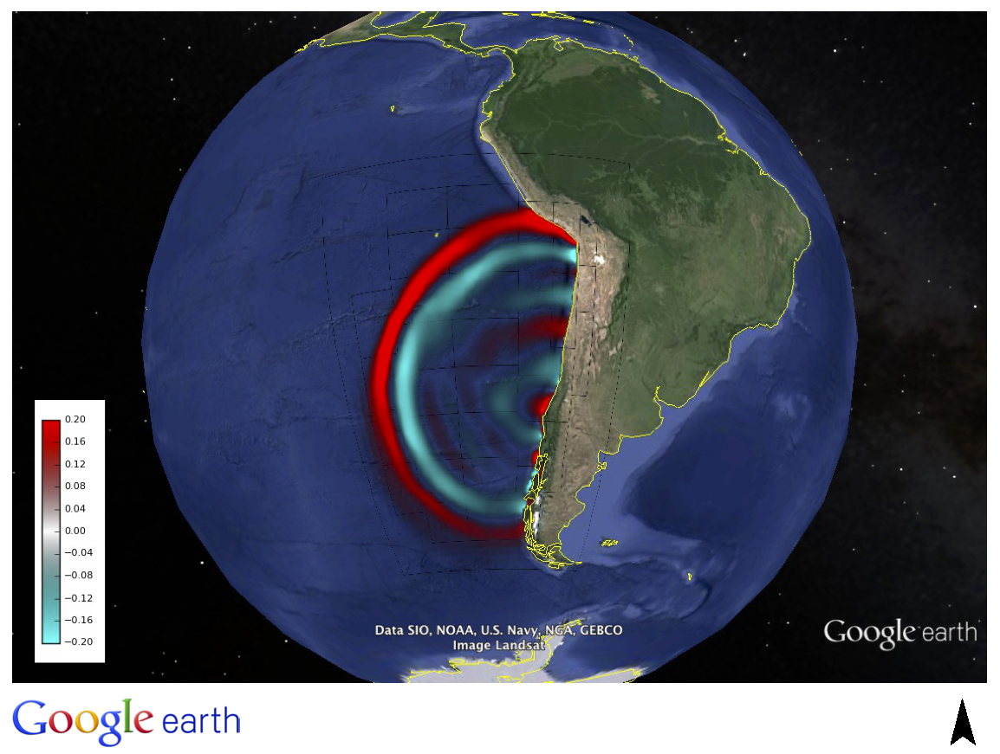
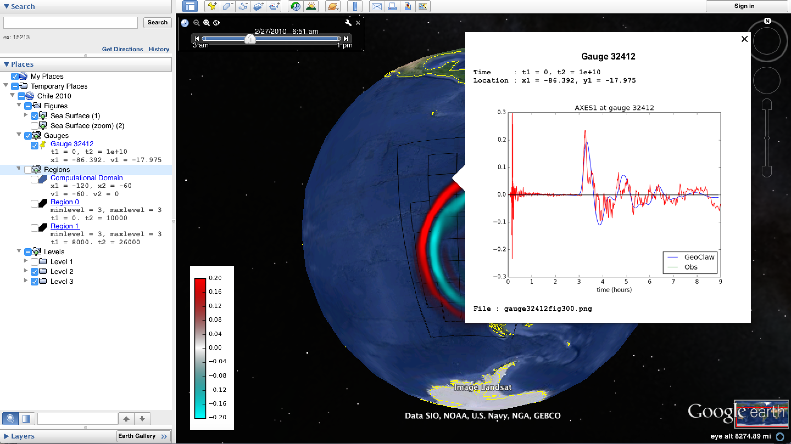
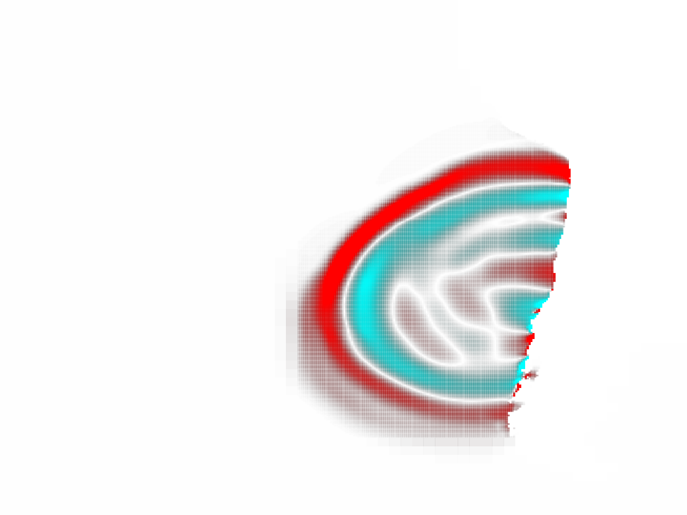
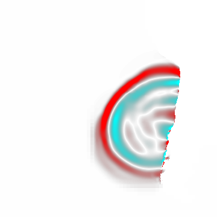

.. _googleearth_plotting:

*******************************************
Visualizing GeoClaw results in Google Earth
*******************************************

.. _Google Earth: http://www.google.com/earth

The `Google Earth`_ browser is a powerful visualization tool for
viewing georeferenced data and images.  The VisClaw visualization suite includes
tools that will produce georeferenced plots and associated KMZ files needed for
animating and browsing your GeoClaw simulation results in Google Earth.  GeoClaw
tsunami simulations are particularly appropriate for the Google Earth
platform in that land topography, ocean bathymetry and wave
disturbances created by tsunamis or other inundation events can all be
viewed simultaneously.

The Google Earth browser is not a fully functional GIS tool, and so
while the simulations may look very realistic, one should not base
critical decisions on conclusions drawn from the Google Earth
visualization alone.  Nevertheless, these realistic visualizations are
useful for setting up simulations and communicating your results.

Basic requirements
==================

.. _lxml: http://pypi.python.org/pypi/lxml/3.4.0
.. _GDAL: http://www.gdal.org
.. _pykml: http://pythonhosted.org/pykml/

To get started,  you will need to install the Python packages `lxml`_ and
`pykml`_.  These libraries can be easily installed through Python
package managers *PIP* and *conda*::

  % conda install lxml   # May also use PIP
  % pip install pykml    # Not available through conda

**Test your installation.** You can test your installation by
importing these modules into Python::

  % python -c "import lxml"
  % python -c "import pykml"

Optional GDAL library
---------------------
To create a pyramid of images for faster loading in Google Earth, you
will also want to install the Geospatial Data Abstraction Library
(`GDAL`_).  The GDAL library (and associated Python bindings)
can be easily installed with *conda*::

  % conda install gdal

On OSX, the GDAL library can also be installed through MacPorts or Homebrew.

Depending on your installation, you may also need to set the
environment variable *GDAL_DATA* to point to the directory containing
projection files (e.g. gcs.cvs, epsg.wkt) needed to
georeference and warp your PNG images.  For example, in Anaconda
Python, these support files are installed under the `share/gdal`
directory.  In *bash*, the *GDAL_DATA* environment variable can be exported
as

.. code-block:: python

    export GDAL_DATA=$ANACONDA/share/gdal

**Note.** It is important to use projection files that are packaged with your particular
installation of *GDAL*.  Mixing installations and projection files can lead to unexpected
errors.

.. _gdal_test.py: http://math.boisestate.edu/~calhoun/visclaw/GoogleEarth/gdal_test.py
.. _frame0005fig1.png: http://math.boisestate.edu/~calhoun/visclaw/GoogleEarth/frame0005fig1.png

**Test your installation.** You can test your installation of the
`GDAL` library by downloading the script `gdal_test.py`_ and
associated image file `frame0005fig1.png`_ (to the same directory) and
running the command::

   % python -c "import gdal_test"

You should get the output::

    %  python -c "import gdal_test"
    Input file size is 1440, 1440
    Creating output file that is 1440P x 1440L.
    Processing input file frame0005fig1_tmp.vrt.
    Using band 4 of source image as alpha.
    Using band 4 of destination image as alpha.
    Generating Base Tiles:
    0...10...20...30...40...50...60...70...80...90...100 - done.
    Generating Overview Tiles:
    0...10...20...30...40...50...60...70...80...90...100 - done.

This test will create an image pyramid in the directory `frame0005fig1` and an associated
`doc.kml` file which you can open in Google Earth.

An example : The Chile 2010 tsunami event
=========================================

.. _Chile_2010.kml: http://math.boisestate.edu/~calhoun/visclaw/GoogleEarth/kml/Chile_2010.kml

The Chile 2010 tsunami is included as an example in the GeoClaw module
of Clawpack.  Once you have run this simulation, you can create the
KMZ file needed for visualizing your data in Google Earth by using the
command::

  % make plots "SETPLOT_FILE=setplot_kml.py"

This runs the commands in *setplot_kml.py*. The resulting archive file
*Chile_2010.kmz* (created in your plots directory) can be opened in
Google Earth.  An on-line version of the results from this example can
be viewed by opening the file `Chile_2010.kml`_ in Google Earth.

Use the time slider to step through the frames of the simulation, or
click on the "animate" button (also in the time slider panel) to animate
the frames.

   Simulation of the Chile 2010 tsunami (see geoclaw/examples/tsunami/chile2010).

Plotting attributes needed for Google Earth
-------------------------------------------

The plotting parameters needed to instruct VisClaw to create plots
suitable for visualization in Google Earth are all set as attributes
of instances of the VisClaw classes *ClawPlotData* and *ClawPlotFigure*.
We describe each of the relevant attributes and refer to their
usage in the Chile 2010 example file `setplot_kml.py` file.

In what follows, we only refer to instances `plotdata` and `plotfigure`
of the `ClawPlotData` and `ClawPlotFigure` classes.

plotdata attributes
-------------------

The following *plotdata* attributes apply to all VisClaw figures to be
visualized in Google Earth.  These attributes are all **optional** and
have reasonable default values.

.. code-block:: python

  #-----------------------------------------
  # plotdata attributes for KML
  #-----------------------------------------
  plotdata.kml_name = "Chile 2010"
  plotdata.kml_starttime = [2010,2,27,6,34,0]  # Date and time of event in UTC [None]
  plotdata.kml_tz_offset = 3    # Time zone offset (in hours) of event. [None]

  plotdata.kml_index_fname = "Chile_2010"  # name for .kmz and .kml files ["_GoogleEarth"]

  # Set to a URL where KMZ file will be published.
  # plotdata.kml_publish = None

  # plotdata.kml_map_topo_to_latlong = None  # Use if topo coords. are not lat/long [None]

.. attribute:: kml_name : string

  Name used in the Google Earth sidebar to identify the simulation. Default : "GeoClaw"

.. attribute:: kml_starttime : [Y,M,D,H,M,S]

  Start date and time, in UTC,  of the event.  The format is *[year,month,day,hour, minute, second]*.
  By default, local time will be used.

.. attribute:: kml_timezone : integer

  Time zone offset, in hours, of the event from UTC.  For example, the offset for Chile is +3 hours,
  whereas the offset for Japan is -9 hours.   Default : no time zone offset.

.. attribute:: kml_index_fname : string

  The name given to the KMZ file created in the plot directory.  Default : "_GoogleEarth"

.. attribute:: kml_publish : string

  A URL address and path to a remote site hosting a
  KMZ file you wish to make available on-line. Default : None

  See `Publishing your results`_ for more details.

.. attribute:: kml_map_topo_to_latlong : function

   A function that maps computational coordinates (in meters, for
   example) to latitude/longitude coordinates.  This will be called to
   position PNG overlays, gauges, patch boundaries, and regions boundaries to the
   latitude longitude box specified in `plotfigure.kml_xlimits` and
   `plotfigure.kml_ylimits` used by Google Earth.
   Default : None.

   See `Mapping topography data to latitude/longitude coordinates`_
   for details on how to set this function.

.. attribute:: kml_use_figure_limits : boolean

   Set to *True* to indicate that the `plotfigure` limits should be
   used as axes limits when creating the PNG file.  If set to *False*,
   then axes limits set by an `axes` member of a *plotfigure*
   (e.g. *plotaxes*) will be used. Default : True.

plotfigure attributes
---------------------

The following attributes apply to an individual figure created for visualization in Google Earth.
The first three attributes are **required**.  The remaining attributes
are optional.

The name "Sea Surface" given to the new instance `plotfigure`, below,
will be used in the Google Earth sidebar to identify this figure.

.. code-block:: python

  #-----------------------------------------------------------
  # Figure - Sea Surface
  #----------------------------------------------------------
  plotfigure = plotdata.new_plotfigure(name='Sea Surface',figno=1)
  plotfigure.show = True

  # Required KML attributes for visualization in Google Earth
  plotfigure.use_for_kml = True
  plotfigure.kml_xlimits = [-120,-60]    # Longitude
  plotfigure.kml_ylimits = [-60, 0.0]    # Latitude

  # Optional attributes
  plotfigure.kml_use_for_initial_view = True
  plotfigure.kml_figsize = [30.0,30.0]
  plotfigure.kml_dpi = 12         # Resolve all three levels
  plotfigure.kml_tile_images = False    # Tile images for faster loading.  Requires GDAL [False]

.. attribute:: use_for_kml : boolean

  Indicates to VisClaw that the PNG files created for this figure should be suitable for
  visualization in Google Earth. With this set to `True`, all titles, axes labels, colorbars
  and tick marks will be suppressed.  Default : `False`.

.. attribute:: kml_xlimits : [longitude_min, longitude_max]

  Longitude range used to place PNG images on Google Earth. *This setting will override
  any limits set as plotaxes attributes*.  **Required**

.. attribute:: kml_ylimits : [latitude_min, latitude_max]

  Latitude range used to place the PNG images on Google Earth.
  *This setting will override any limits set as plotaxes attributes*.  **Required**

.. attribute:: kml_use_for_initial_view : boolean

  Set to `True` if this figure should be used to determine the initial
  camera position in Google Earth.  The initial camera position will
  be centered over this figure at an elevation equal to approximately
  twice the width of the figure, in meters.  By default, the first
  figure encountered with the `use_for_kml` attribute set to *True*
  will be used to set the initial view.

.. attribute:: kml_figsize :  [size_x_inches,size_y_inches]

   The figure size, in inches, for the PNG file.  See `Removing
   aliasing artifacts`_ for tips on how to set the figure size and dpi
   for best results.  Default : 8 x 6 (chosen by Matplotlib).

.. attribute:: kml_dpi : integer

  Number of pixels per inch used in rendering PNG figures.  For best
  results, figure size and dpi should be set to respect the numerical
  resolution of the the simulation.  See `Removing aliasing
  artifacts`_ below for more details on how to improve the quality of
  the PNG files created by Matplotlib.  Default : 200.

.. attribute:: kml_tile_images : boolean

   Set to `True` if you want to create a pyramid of images at different
   resolutions for faster loading in Google Earth.  *Image tiling
   requires the GDAL library*.  See `Optional GDAL library`_, above,
   for installation instructions.  Default : False.

Creating the figures
--------------------

All figures created for Google Earth are rendered as PNG files using
the Matplotlib backend.  So in this sense, the resulting PNG files are
created in a manner that is no different from other VisClaw output
formats.  Furthermore, there are no special `plotaxes` or *plotitem*
attributes to set for KML figures.  But several attributes will either
be ignored by the KML output or should  be suppressed for best results
in Google Earth.

.. code-block:: python

  # Create the figure
  plotaxes = plotfigure.new_plotaxes('kml')

  # Create a pseudo-color plot.  Render the sea level height transparent.
  plotitem = plotaxes.new_plotitem(plot_type='2d_pcolor')
  plotitem.plot_var = geoplot.surface_or_depth
  plotitem.cmin = -0.2
  plotitem.cmap = 0.2
  plotitem.pcolor_cmap = googleearth_transparent

  # Create a colorbar (appears as a Screen Overlay in Google Earth).
  def kml_colorbar(filename):
    cmin = -0.2
    cmax = 0.2
    cmap = geoplot.googleearth_transparent
    geoplot.kml_build_colorbar(filename,cmap,cmin,cmax)

  plotfigure.kml_colorbar = kml_colorbar

plotaxes attributes
^^^^^^^^^^^^^^^^^^^

The plotaxes attributes
`colorbar`, `xlimits`, `ylimits` and `title` will all be ignored by the KML plotting.
For best results, the attribute `scaled` should be set to its default value `False`.  The
only plotaxes attribute that might be useful in some limited contexts is the `afteraxes`
setting, and only if the `afteraxes` function does not add plot features that cause
Matplotlib to alter the space occupied by the figure.   In most cases, the `afteraxes`
commands should not be needed or should not be used.

plotitem attributes
^^^^^^^^^^^^^^^^^^^

The most useful `plotitem` type will probably be the `2d_pcolor` type, although other
types including the filled contour `contourf` can also be used to good effect.

Colormaps that are designed to work well with Google Earth are

* `geoplot.googleearth_transparent`
* `geoplot.googleearth_lightblue`
* `geoplot.googleearth_darkblue`

The transparent
colormap is particularly appealing visually when overlaid onto the Google Earth because
the ocean bathymetry is clearly visible, illustrating the effect that underwater ridges
and so on have on the propagating tsunami. The other two colormaps
are solid colormaps, where the sea level color is set to match that of lighter or darker
regions of the Google Earth ocean bathymetry.

Adding a colorbar overlay
^^^^^^^^^^^^^^^^^^^^^^^^^

A colorbar can be associated with each figure in the Google Earth
browser by setting the figure attribute `kml_colorbar` to point to a function
that creates the colorbar::

  # Create a colorbar (appears as a Screen Overlay in Google Earth).
  def kml_colorbar(filename):
    cmin = -0.2
    cmax = 0.2
    cmap = geoplot.googleearth_transparent
    geoplot.kml_build_colorbar(filename,cmap,cmin,cmax)

  plotfigure.kml_colorbar = kml_colorbar

The color axis range `[cmin, cmax]` and the colormap `cmap` should be
consistent with those set as plotitem attributes.  By expanding the
figure folder in the Google Earth sidebar, you can use check boxes to
hide or show the colorbar screen overlay.

The input argument `filename` should be passed unaltered to the
routine `geoplot.kml_build_colorbar`.

Gauge plots
-----------

There are no particular attributes for gauge plots and so they
can be created in the usual way.  In the Google Earth browser, gauge locations
will be displayed as Placemarks.  Clicking on gauge Placemarks will bring
up the individual gauge plots.  The screenshot below shows the gauge plot
that appears when either the gauge Placemark or the gauge label in the sidebar is
clicked.

   Screenshot illustrating gauge plots.

If the computational coordinates are not in latitude/longitude coordinates, then you must
set the `plotdata` attribute `map_topo_to_latlong` to specify a mapping between the computational
coordinates and latitude longitude box which Google Earth will use to visualize your data.
See `plotdata attributes`_.

Additional plotdata attributes
------------------------------

VisClaw has additional `plotdata` attributes indicating which figures and frames
to plot and which output style to create.  When plotting for Google
Earth, one additional output parameter is necessary.

.. code-block:: python

  #-----------------------------------------
  plotdata.print_format = 'png'      # file format
  plotdata.print_framenos = 'all'    # list of frames to print
  plotdata.print_fignos = 'all'      # list of figures to print
  plotdata.html = False              # create html files of plots?
  plotdata.latex = False             # create latex file of plots?
  # ....
  plotdata.kml = True        # <====== Set to True to create KML/KMZ output

  return plotdata   # end of setplot_kml.py file

.. attribute:: kml : boolean

   Set to `True` to indicate that a KML/KMZ file should be created. Default : False.

Plotting tips
=============
Below are tips for working with KML/KMZ files, creating zoomed images,
improving the quality of your images and publishing your results.

KML and KMZ files
-----------------
KML files are very similar to HTML files in that they contan
`<tags>...</tags>` describing data to be rendered by a suitable
rendering engine.  Whereas as standard web browsers can render content
described by HTML tags, Google Earth renders the geospatial data
described by KML-specific tags.

The `kml` attributes described above will direct VisClaw to create
Google Earth suitable PNG files
for frames and colorbars and a hierarchy of linked KML files,
including a top level `doc.kml` file for the entire simulation, one
top level `doc.kml` file per figure, and additional referenced kml
files per frame.  These KML and image files will not appear
individually in your plots directory, but are archived into a single
KMZ file that you can load in Google Earth.

If you would like to browse the individual images and KML files created
by VisClaw, you can extract them from the KMZ file using an un-archiving
utility. On OSX, for example, you can use `unzip` to extract one or
more individual files from the KMZ file.  Other useful `zip` utilities
include `zip` (used to create the KMZ file initially) and `zipinfo`.

One reason you might wish to view the contents of an individual KMZ
file is to inspect the PNG images generated by Matplotlib and used as
GroundOverlays in the Google Earth browser.  Another reason may be
that you wish to make minor edits the top level doc.kml file to add
additional Google Earth sidebar entries or to change visibility
defaults of individual folders.

The KMZ file can be posted to a website to share your results with others.
See `Publishing your results`_, below.

.. _Creating an image pyramid:

Tiling images for faster loading
--------------------------------

If you create several frames with relatively high dpi, you may find
that the resulting KMZ file is slow to load in Google Earth.  In
extreme cases, large PNG files will not load at all.  You can improve
Google Earth performance by creating an image hierarchy which loads
only a low resolution sampling of the data at low zoom levels and
higher resolution images suitable for close-up views.  In VisClaw,
this image pyramid is created by setting the plotfigure attribute
`kml_tile_images` to `True`.

.. code-block:: python

   plotfigure.kml_tile_images = True

**Note:** This requires the GDAL library, which can be installed following the
`Optional GDAL library`_ instructions, above.

.. _Enhancing the resolution:

Removing aliasing artifacts
---------------------------

You may find that the transparent colormap leads to unappealing visual
artifacts.  This can happen when the resolution of the PNG file does
not match the resolution of the data used to create the image.  In the
Chile example, the number of grid cells on the coarsest level is 30 in
each direction. Two additional levels are created by refining first by
a factor of 2 and then by a factor of 6.  But the default settings for
the figure size (`kml_figsize`) is `8x6` inches and dpi (`kml_dpi`) is
200, resulting in an image that is 1600 x 1200.  But because 1600 is
not an even multiple of 30, noticeable vertical stripes appear at the
coarsest level.  A more obvious plaid pattern appears at finer levels,
since neither 1600 or 1200 are evenly divisible by 30*2*6 = 360.

   Aliasing effects resulting from default `kml_dpi` and `kml_figsize` settings

We can remove these aliasing effects by making the resolution of the
PNG file a multiple of 30*2*6 = 360.  This can be done by setting the
figure size and dpi appropriately::

  # Set dpi and figure size to resolve the 30x30 coarse grid, and two levels of refinement with
  # refinement factors of 2 and 6.
  plotfigure.kml_figsize = [30,30]
  plotfigure.kml_dpi = 12

The resulting PNG file has a resolution of only 360x360, but in fact, is free of
the vertical and horizontal stripes that appeared in the much higher resolution image
created from the default settings.

   Aliasing effects removed by properly setting `kml_dpi` and `kml_figsize`

This baseline dpi=12 is the minimum resolution that will remove
striped artifacts from your images. However, you may find that this
resolution is unacceptable, especially for close-up views of
shorelines and so on. In this case, you can increase the resolution of
the figure by integer factors of the baseline dpi.  In the Chile
example, you might try increasing the dpi to 24 or even 48.  The resulting
PNG file, when rendered in Google Earth, should be much sharper when
zoomed in for coastline views.

In some cases, it might not be possible to fully resolve all levels of
a large multi-level simulation because the resulting image resolution
would exceed the Matplotlib limit of 32768 pixels on a side.  In this case,
you can limit the number of levels that are resolved by a particular
figure and create zoomed in figures to resolve finer levels. See
`Creating multiple figures at different resolutions`_, below.
Alternatively, you can break the computational domain into several
figures, each covering a portion of the entire domain.

If you set `kml_dpi` to a value less than 10, Matplotlib will revert to
a dpi of 72 and change the figure size accordingly, so that the
total number of pixels in each direction will still be equal to
`kml_figsize*kml_dpi`, subject to round-off error.  While you can
avoid aliasing effects if this happens (assuming the dpi is still
consistent with the resolution of the simulation), you can prevent
Matplotlib from switching to a 72 dpi by simply reducing your figure
size by a factor of 10 and increasing your dpi by a factor of 10.

Creating multiple figures at different resolutions
--------------------------------------------------
You can create several figures for visualization in Google Earth.
Each figure you create will show up as a separate named folder in the Google
Earth sidebar.  The name will match that given to the VisClaw *plotfigure*.

For at least one figure, you will probably want to set
the `kml_xlimits` and `kml_ylimits` to match the computational domain.
To get higher resolution zoomed in figures, you will want to restrict
the x- and y-limits to a smaller region.  For best results, these zoom
regions should be consistent with the resolution of your simulation.
In the Chile example, a 30x30 inch figure resolves two degrees per inch.
The x- and y-limits for the zoomed in figure should then span an even
number of degrees in each direction, and have boundaries that align
with even degree marks, i.e. -120, -118, -116, etc.  In **setplot_kml.py**,
the zoomed in region is described as :

.. code-block:: python

    #-----------------------------------------------------------
    # Figure for KML files (zoom)
    #----------------------------------------------------------
    plotfigure = plotdata.new_plotfigure(name='Sea Surface (zoom)',figno=2)
    plotfigure.show = True

    plotfigure.use_for_kml = True
    plotfigure.kml_use_for_initial_view = False  # Use large plot for view

    # Zoomed figure created for Chile example.
    plotfigure.kml_xlimits = [-84,-74]    # 10 degrees
    plotfigure.kml_ylimits = [-18,-4]     # 14 degrees
    plotfigure.kml_figsize = [10,14]  # inches. (1 inch per degree)

    # Resolution
    rcl = 10    # Over-resolve the coarsest level
    plotfigure.kml_dpi = rcl*2*6       # Resolve all three levels
    plotfigure.kml_tile_images = False  # Tile images for faster loading.

The resulting figure will have a resolution of 120 dots (i.e. pixels) per inch, compared to the
12 dpi in the larger PNG file covering the whole domain.  The resolution of the zoomed
image is 1200x1680, compared to 360x360 for the larger domain.

This higher resolution figure shows up in the  Google Earth sidebar as "Sea Surface (zoom)".

See `Removing aliasing artifacts`_ for more details on how to set the zoom levels.

.. _Publishing your results:

Mapping topography data to latitude/longitude coordinates
---------------------------------------------------------
In many situations, your computational domain may not be conveniently
described in latitude/longitude coordinates. When simulating overland
flooding events, for example, topographic data may more easily be
described in rasterized distance increments (meters, for example).
VisClaw uses data stored in generated data files (`gauges.data`,
`regions.data`, and so on) to position objects on the Google Earth
browser.  The coordinate system for these objects is, however, in
computational coordinates, and so to locate them in the Google Earth
browser, the user must provide VisClaw a function to convert from
computational to latitude/longtitude coordinates.  This is done by
setting the `plotdata` attribute `kml_map_topo_to_latlong` to a
function describing your mapping between the two coordinate systems.

A crucial underlying assumption in setting the mapping function for
use with GoogleEarth is that the boundary of your physical domain is
approximately aligned with spherical (latitude/longitude) coordinate
lines.

The following example illustrates how to set a linear map between the
coordinates in `[0,48000]x[0,17540]` and the latitude/longitude
coordinates that Google Earth will use to visualize the results of
your simulation.

.. code-block:: python

    def map_cart_to_latlong(xc,yc):
	# Map x-coordinates
        topo_xlim = [0,48000]                     # x-limits, in meters
        ge_xlim = [-111.96132553, -111.36256443]  # longitude limits
        slope_x = (ge_xlim[1]-ge_xlim[0])/(topo_xlim[1]-topo_xlim[0])
        xp = slope_x*(xc-topo_xlim[0]) + ge_xlim[0]

	# Map y-coordinates
	topo_ylim = [0,17500]                     # y-limits, in meters
        ge_ylim = [43.79453362, 43.95123268]      # latitude limits
        slope_y = (ge_ylim[1]-ge_ylim[0])/(topo_ylim[1]-topo_ylim[0])
        yp = slope_y*(yc-topo_ylim[0]) + ge_ylim[0]

        return xp,yp

    # set plotdata attribute.
    plotdata.kml_map_topo_to_latlong = map_cart_to_latlong

Figure limits `plotfigure.kml_xlimits` and `plotfigure.kml_ylimits` must still be set to
the latitude/longitude coordinates for your Google Earth figure.  But to indicate that you
do not wish to use these coordinates for creating PNG files, you must set
the `plotfigure.kml_use_figure_limits` attribute to `False`.  This will indicate that when
creating the PNG figure, the axes limits should be set to those specifed in the
`plotaxes` attribute.  For example,

.. code-block:: python

    plotfigure = plotdata.new_plotfigure(name='Teton Dam',figno=1)
    plotfigure.use_for_kml = True

    # Latlong box used for GoogleEarth
    plotfigure.kml_xlimits = [-111.96132553, -111.36256443]  #  Lat/Long box use by Google Earth
    plotfigure.kml_ylimits = [43.79453362, 43.95123268]

    # Use computational coordinates for plotting
    plotfigure.kml_use_figure_limits = False   # Use plotaxes limits below

    # ....

    plotaxes.xlimits = [0,48000]   # Computational axes needed for creating PNG files.
    plotaxes.ylimits = [0,17500]

The mapping function will be used to position PNG Overlays, locate gauge placemarks,
and plot patch and region boundaries on the Google Earth browser.

Publishing your results
-----------------------

You can easily share your results with collaborators
by providing links to your archive KMZ file in HTML webpages.  Collaborators can
download the KMZ file and open it in a Google Earth browser.

If you find that the KMZ file is too large to make downloading
convenient, you can provide a light-weight KML file that contains a
link to your KMZ file stored on a host server.  Collaborators can then
open this KML file in Google Earth and browse your results remotely.

VisClaw offers an option to automatically create a sample
KML file containing a link to your KMZ file.
To create this KML file, you should set the `plotdata` attribute
`kml_publish` to the url address of your host server where the KMZ
files will be stored.  For example, the Chile file above is stored at::

  plotdata.kml_publish = "http://math.boisestate.edu/~calhoun/visclaw/GoogleEarth/kmz"

VisClaw will detect that this `plotdata` attribute has been set and
automatically create a KML file that refers to the linked file
"Chile_2010.kmz", stored at the above address.  This KML file (see
`Chile_2010.kml`_ for an example) can be easily edited, shared or posted on webpages to allow
collaborators to view your results via links to your remotely stored
KMZ file.

By default,  `plotdata.kml_publish` is set to `None`, in which case, no KML file will be created.
