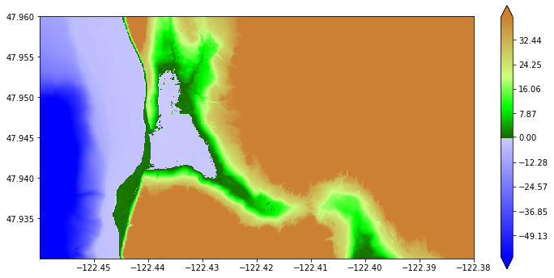
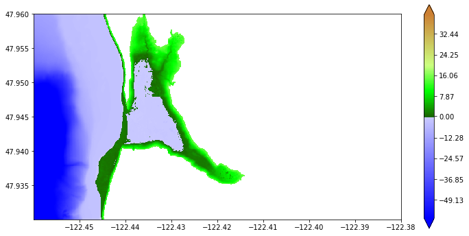
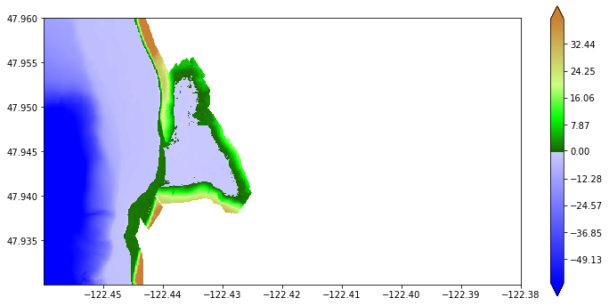
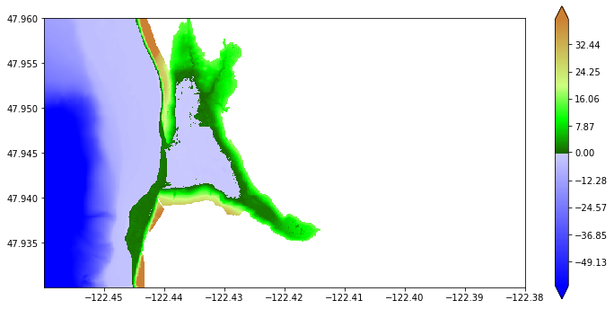
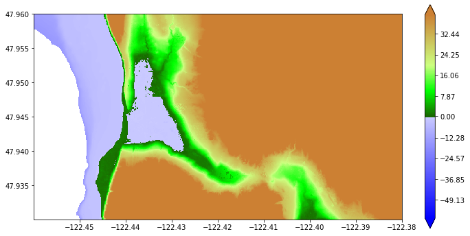
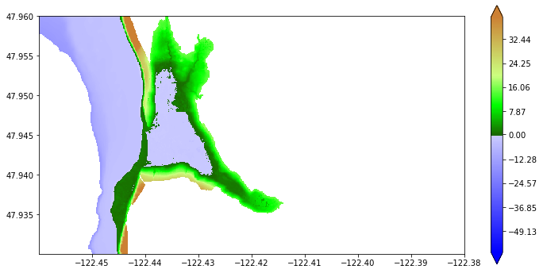
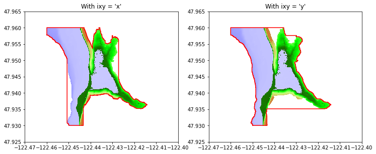
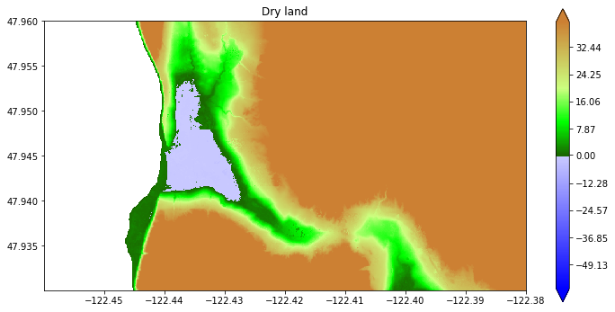

.. _marching_front:

Marching Front algorithm
========================

**New in Version 5.7.0.**

Adapted from `this notebook
<http://www.clawpack.org/gallery/_static/apps/notebooks/geoclaw/MarchingFront.html>`_.

The module `clawpack.geoclaw.marching_front` defines a function
`select_by_flooding` that takes as input an array `Ztopo` containing
topography elevations on a rectangular grid and returns an array
`pt_chosen` of the same shape with values 1 (if chosen) or 0 (if not
chosen). Other inputs specify the criteria used to choose points, as
described below.

The basic idea is that chosen points satisfy certain elevation
requirements along with connectivity to the coast. This was originally
developed to identify points in a topography DEM where the topography
value :math:`Z` is below MHW, but that should be initialized as dry land
because they are in regions protected by dikes or levies. In this
situation, the marching algorithm is used by initializing points well
offshore (e.g. with :math:`Z < -5` meters) as *wet* and other points to
*unset*. Then the front between *wet/unset* points is advanced by
marking neighboring points as *dry* if :math:`Z\geq0` or as *wet* if
:math:`Z<0`. This is repeated iteratively for each new front until there
are no more *wet* points with *unset* neighbors. At this point any
points still *unset* are entirely buffered by *dry* points and must lie
behind dikes, so these are also set to *dry*.

The use of such a `force_dry_array` in GeoClaw is explained in
:ref:`force_dry`.

Other applications are also described below along with some examples.

Contents
--------

-  `Function arguments <#mf-args>`__

-  `Output array <#mf-output>`__

-  `The mask argument <#mf-mask>`__

-  `The previous_pts_chosen argument <#mf-prev>`__

-  `Examples <#mf-examples>`__

   -  `Finding points below a given elevation <#mf-find-Zlow>`__
   -  `Choose points only near shore <#mf-find-nearshore>`__
   -  `Write out the masked array indicating fgmax
      points <#mf-fgmax-file>`__
   -  `Creating an AMR flag region <#mf-amr-flag>`__
   -  `Determining dry areas below MHW <#mf-dry>`__

Function arguments
------------------

The main function in the `marching_front.py` module is
`select_by_flooding`.

The function is defined by:

::

   def select_by_flooding(Ztopo, mask=None, prev_pts_chosen=None,
                          Z1=-5., Z2=0., max_iters=None, verbose=False):

If `Z1 <= Z2` then points where `Ztopo < Z1` are first selected and
then a marching algorithm is used to select neighboring points that
satisfy `Ztopo < Z2`.

Think of chosen points as “wet” and unchosen points as “dry” and new
points are flooded if at least one neighbor is “wet” and the topography
is low enough. Starting from deep water (e.g. `Z1 = -5`) this allows
flooding up to MHW (`Z2 = 0`) without going past dikes that protect
dry land with lower elevation.

However, this can also be called with `Z1 > Z2`, in which case points
where `Ztopo >= Z1` are first selected and then the marching algorithm
is used to select neighboring points that satisfy `Ztopo > Z2`. This
is useful to select offshore points where the water is shallow, (and
that are connected to the shore by a path of shallow points) e.g. to
identify points on the continental shelf to set up a flag region for
refinement.

If `max_iters=None` then iterate to convergence. Otherwise, at most
`max_iters` iterations are taken, so setting this to a small value
only selects points within this many grid points of where
`Ztopo <= Z1`, useful for buffering or selecting a few onshore points
along the coast regardless of elevation.

If `prev_pts_chosen` is None we are starting from scratch, otherwise
we possibly add additional chosen points to an existing array. Points
where `prev_pts_chosen[i,j]==1` won’t change but those `==0` may be
changed to 1 based on the new criteria.

If `mask==None` or `mask==False` then the entire array is subject to
selection. If `mask` is an array with `mask[i,j]==True` at some
points, then either: - these masked points are marked as not selected
(`pts_chosen[i,j]=0`) if `prev_pts_chosen==None`, or - these masked
points are not touched if `prev_pts_chosen` is an array (so previous
0/1 values are preserved).

These arguments are described in more detail below with examples of how
they might be used.

.. _mf-output:

output array
------------

The function returns an array `pt_chosen` with the same shape as
`Ztopo` and has the value 1 at points chosen and 0 at points not
chosen.

creating a masked array
~~~~~~~~~~~~~~~~~~~~~~~

This array can be used to define a masked array from `Ztopo` that
masks out the points not chosen via:

::

   from numpy import ma # masked array module
   Zmasked = ma.masked_array(Ztopo, mask=logical_not(pt_chosen))

This could be used to plot only the points chosen using the matplotlib
function `pcolormesh`, for example, or the function now defined in
`geoclaw.visclaw.plottools.pcolorcells` that better plots finite
volume grid cell data with proper alignment and boundary cells. See
:ref:`pcolorcells`.

topofile mask for initializing dry points
~~~~~~~~~~~~~~~~~~~~~~~~~~~~~~~~~~~~~~~~~

The array `pt_chosen` can be used to create a file that is read in by
GeoClaw to identify points where `Ztopo` is below MHW but where there
is dry land because of protection by dikes or levies. This is done by
defining a `geoclaw.topotools.Topography` object and setting its `Z`
attribute based on `pt_chosen`, and then writing this as a topofile
with `topo_type==3`. Then in `setrun.py` this file can be specified
as a mask that is read in and used when initializing grid cells. There
are some subtleties in how this is done, described in more detail in
:ref:`force_dry`.

fgmax points
~~~~~~~~~~~~

The chosen points might be used as fgmax points, as described below.

flag regions
~~~~~~~~~~~~

The output array could also be used to define an AMR flag region as a
ruled rectangle, using the function
`region_tools.ruledrectangle_covering_selected_points` described in
:ref:`ruled_rectangles`.  This would give a
minimal ruled rectangle covering all the chosen points. An example is
given `below <#amr-flag>`__.

.. _mf-mask:

The `mask` argument
---------------------

`mask` can be `False` or `None`, or else must be an array of the
same shape as `Ztopo`.

The `Ztopo` array input must be a rectangular array, but sometimes we
want to select points covering only a subset of these points, e.g. when
defining fgmax points along some stretch of coastline. In this case
`mask` can be used to mask out values we do not want to select. Set
`mask[i,j] = True` at points that should *not* be chosen.

To mask out points that lie outside some ruled rectangle that has been
defined as `rr`, you can use the `rr.mask_outside` function to
define the mask. See :ref:`ruled_rectangles`.

.. _mf-prev:

The `previous_pts_chosen` argument
------------------------------------

This argument is useful if you want to apply a sequence of different
criteria to choose points. For example, suppose you first want to choose
all grid points within 5 points of the coast (as can be done using
`max_iters`) and then supplement this will all grid points below a
specified elevation that are farther inland from the coast.

Examples are given below, also of how the `mask` array works in
conjunction with `previous_pts_chosen`.

.. _mf-examples:

Examples
--------

First import some needed modules and set up color maps.

.. code:: ipython3

    import os,sys
    from numpy import ma # masked arrays
    from clawpack.visclaw import colormaps
    from clawpack.geoclaw import topotools, marching_front
    from clawpack.amrclaw import region_tools
    from clawpack.visclaw.plottools import pcolorcells

    zmin = -60.
    zmax = 40.
    
    cmap_land = colormaps.make_colormap({ 0.0:[0.1,0.4,0.0],
                                         0.25:[0.0,1.0,0.0],
                                          0.5:[0.8,1.0,0.5],
                                          1.0:[0.8,0.5,0.2]})
    
    cmap_sea = colormaps.make_colormap({ 0.0:[0,0,1], 1.:[.8,.8,1]})
    
    cmap_topo, norm_topo = colormaps.add_colormaps((cmap_land, cmap_sea),
                                         data_limits=(zmin,zmax),
                                         data_break=0.)
    
    cmap_sea_dry = colormaps.make_colormap({ 0.0:[1.0,0.7,0.7], 1.:[1.0,0.7,0.7]})
    cmap_dry, norm_dry = colormaps.add_colormaps((cmap_land, cmap_sea_dry),
                                         data_limits=(zmin,zmax),
                                         data_break=0.) 

Sample topography from a 1/3 arcsecond DEM
------------------------------------------

We consider a small region on the SW coast of Whidbey Island north of
Maxwelton Beach as an example:

.. code:: ipython3

    region1_png = imread('region1.png')
    extent = [-122.46, -122.38, 47.93, 47.96]
    
    figure(figsize=(12,6))
    imshow(region1_png, extent=extent)
    gca().set_aspect(1./cos(48*pi/180.))

.. image:: MarchingFront/output_13_0.png

We read this small portion of the 1/3 arcsecond Puget Sound DEM,
available from the NCEI thredds server:

.. code:: ipython3

    path = 'https://www.ngdc.noaa.gov/thredds/dodsC/regional/puget_sound_13_mhw_2014.nc'
    topo = topotools.read_netcdf(path, extent=extent)

.. code:: ipython3

    figure(figsize=(12,6))
    pcolorcells(topo.X, topo.Y, topo.Z, cmap=cmap, norm=norm)
    colorbar(extend='both')
    gca().set_aspect(1./cos(48*pi/180.))

This plot shows that there is a region with elevation below MHW (0 in
the DEM) where the Google Earth image shows wetland that should not be
initialized as a lake. This problem is discussed in :ref:`force_dry`.

Here we show how to choose only the DEM points that are close to the
shore and/or below a given elevation.

.. _mf-find-Zlow:

Finding all points below a given elevation
~~~~~~~~~~~~~~~~~~~~~~~~~~~~~~~~~~~~~~~~~~

First we choose all points with elevation below 15 m and that are
connected to the coast over this topography extent. Note the latter
requirement will eliminate the low lying area at the bottom of the
figure above near longitude -122.4 (which is connected to the coast
through Cultus Bay, but not by points in this extent).

.. code:: ipython3

    pts_chosen = marching_front.select_by_flooding(topo.Z, Z1=0, Z2=15., max_iters=None) 

.. parsed-literal::

        Selecting points with Z1 = 0, Z2 = 15, max_iters=279936
        Done after 183 iterations with 89871 points chosen

.. code:: ipython3

    Zmasked = ma.masked_array(topo.Z, logical_not(pts_chosen))

    figure(figsize=(12,6))
    pcolorcells(topo.X, topo.Y, Zmasked, cmap=cmap, norm=norm)
    colorbar(extend='both')
    gca().set_aspect(1./cos(48*pi/180.))

Create a buffer zone along shore
~~~~~~~~~~~~~~~~~~~~~~~~~~~~~~~~

To select more points along the shore where the topography is steep, we
could have first used `max_iters`.

To illustrate this, we start again and fist use `max_iters = 20` so
that at least 20 grid points are selected near the coast, also setting
`Z2 = 1e6` (a huge value) so that the arbitrarily high regions will be
included if they are within 20 points of the coast:

.. code:: ipython3

    pts_chosen = marching_front.select_by_flooding(topo.Z, Z1=0, Z2=1e6, max_iters=20) 

.. parsed-literal::

    Selecting points with Z1 = 0, Z2 = 1e+06, max_iters=20
    Done after 20 iterations with 84800 points chosen

Plot what we have so far:

.. code:: ipython3

    Zmasked = ma.masked_array(topo.Z, logical_not(pts_chosen))
    
    figure(figsize=(12,6))
    pcolorcells(topo.X, topo.Y, Zmasked, cmap=cmap, norm=norm)
    colorbar(extend='both')
    gca().set_aspect(1./cos(48*pi/180.))

Then we augment the points already chosen with any points below 15 m and
connected to the coast:

.. code:: ipython3

    pts_chosen = marching_front.select_by_flooding(topo.Z, Z1=0, Z2=15., 
                                                   prev_pts_chosen=pts_chosen,
                                                   max_iters=None) 

.. parsed-literal::

    Selecting points with Z1 = 0, Z2 = 15, max_iters=279936
    Done after 163 iterations with 94297 points chosen

.. code:: ipython3

    Zmasked = ma.masked_array(topo.Z, logical_not(pts_chosen))
    
    figure(figsize=(12,6))
    pcolorcells(topo.X, topo.Y, Zmasked, cmap=cmap, norm=norm)
    colorbar(extend='both')
    gca().set_aspect(1./cos(48*pi/180.))

.. _mf-find-nearshore:

Choose points only near shore
~~~~~~~~~~~~~~~~~~~~~~~~~~~~~

We can set `Z1 = 0` and `Z2 = -15` to select points that have
elevation *greater than* -15 m and are connected to the coast:

.. code:: ipython3

    pts_chosen_shallow = marching_front.select_by_flooding(topo.Z, Z1=0, Z2=-15., max_iters=None) 

.. parsed-literal::

    Selecting points with Z1 = 0, Z2 = -15, max_iters=279936
    Done after 177 iterations with 249577 points chosen

.. code:: ipython3

    Zshallow = ma.masked_array(topo.Z, logical_not(pts_chosen_shallow))

    figure(figsize=(12,6))
    pcolorcells(topo.X, topo.Y, Zshallow, cmap=cmap, norm=norm)
    colorbar(extend='both')
    gca().set_aspect(1./cos(48*pi/180.))

Note that this chooses *all* onshore points in addition to offshore
points with elevation greater than -15 m.

We can take the intersection of this set of points with the onshore
points previously chosen to get only the points that lie near the coast:

.. code:: ipython3

    pts_chosen_nearshore = logical_and(pts_chosen, pts_chosen_shallow)
    Znearshore = ma.masked_array(topo.Z, logical_not(pts_chosen_nearshore))

    figure(figsize=(12,6))
    pcolorcells(topo.X, topo.Y, Znearshore, cmap=cmap, norm=norm)
    colorbar(extend='both')
    gca().set_aspect(1./cos(48*pi/180.))

.. _mf-fgmax-file:

Write out the masked array indicating fgmax points
--------------------------------------------------

One we have selected the desired fgmax points, these can be output in
the style of a `topo_type=3` topography file, with a header followed
point values at all points on a uniform grid. The values are simply the
integer 1 for points that should be used as fgmax points and 0 for other
points. Note that format `%1i` is used for compactness.

.. code:: ipython3

    fname_fgmax_mask = 'fgmax_pts_topostyle.data'
    topo_fgmax_mask = topotools.Topography()
    topo_fgmax_mask._x = topo.x
    topo_fgmax_mask._y = topo.y     
    topo_fgmax_mask._Z = where(pts_chosen_nearshore, 1, 0)  # change boolean to 1/0
    topo_fgmax_mask.generate_2d_coordinates()
    
    topo_fgmax_mask.write(fname_fgmax_mask, topo_type=3, Z_format='%1i')
    print('Created %s' % fname_fgmax_mask)

.. parsed-literal::

    Created fgmax_pts_topostyle.data

This file `fgmax_pts_topostyle.data` can then be read into GeoClaw,
using the new capability of specifying fgmax grids in this manner, using
`point_style == 4` as described in
:ref:`fgmax`.

.. _mf-amr-flag:

Creating an AMR flag region
---------------------------

Once a set of points has been selected, it can be used to define a ruled
rectangle that might be used as an adaptive mesh refinement flag region,
for example. See :ref:`ruled_rectangles` and :ref:`flagregions`.

You might want to try both `ixy = 'x'` and `ixy = 'y'` in creating
the ruled rectangle to see which one covers fewer non-selected points.
In this case `ixy = 'x'` is better:

.. code:: ipython3

    figure(figsize=(12,5))
    subplot(121)
    
    rr = region_tools.ruledrectangle_covering_selected_points(topo.X, topo.Y, pts_chosen_nearshore, 
                                                              ixy='x', method=0,
                                                              padding=0, verbose=True)
    xv,yv = rr.vertices()
    pcolorcells(topo.X, topo.Y, Znearshore, cmap=cmap, norm=norm)
    axis([-122.47, -122.40, 47.925, 47.965])
    gca().set_aspect(1./cos(48*pi/180.))
    plot(xv, yv, 'r')
    title("With ixy = 'x'")
    
    subplot(122)
    rr = region_tools.ruledrectangle_covering_selected_points(topo.X, topo.Y, pts_chosen_nearshore, 
                                                              ixy='y', method=0,
                                                              padding=0, verbose=True)
    xv,yv = rr.vertices()
    pcolorcells(topo.X, topo.Y, Znearshore, cmap=cmap, norm=norm)
    axis([-122.47, -122.40, 47.925, 47.965])
    gca().set_aspect(1./cos(48*pi/180.))
    plot(xv, yv, 'r')
    title("With ixy = 'y'")

.. parsed-literal::

    Extending rectangles to cover grid cells
    RuledRectangle covers 69788 grid points
    Extending rectangles to cover grid cells
    RuledRectangle covers 76005 grid points

.. _mf-dry:

Determining dry areas below MHW
-------------------------------

Note the blue region in the above plot that is inland from the coast and
behind a green barrier. Examining Google Earth shows that this is
wetland area that probably should not be initialized as a lake. We can
identify this by using the marching front algorithm to start at
`Z1 = -5` m and fill in up to `Z2 = 0` (MHW).

.. code:: ipython3

    wet_points = marching_front.select_by_flooding(topo.Z, Z1=-5., Z2=0., max_iters=None)

.. parsed-literal::

    Selecting points with Z1 = -5, Z2 = 0, max_iters=279936
    Done after 112 iterations with 59775 points chosen

.. code:: ipython3

    Zdry = ma.masked_array(topo.Z, wet_points)

    figure(figsize=(12,6))
    pcolorcells(topo.X, topo.Y, Zdry, cmap=cmap, norm=norm)
    colorbar(extend='both')
    gca().set_aspect(1./cos(48*pi/180.))
    title('Dry land');

Now the blue region above is properly identified as being dry land.

See :ref:`force_dry` for more
discussion of this example, showing how to create an array for
GeoClaw in order to indicate that this region should be initialized as dry in
spite of being below MHW.

