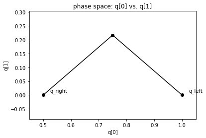
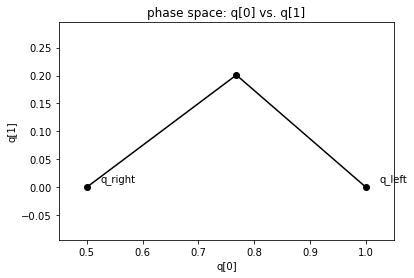

.. _Shallow_water_Riemann_solvers:

Shallow water Riemann solvers in Clawpack
=========================================

A wide range of shallow water (SW) solvers are available in
`clawpack.riemann`. Here’s a brief description of each. For each one,
we have indicated (after “Fortran:”) the files you should compile to use
it in the Fortran codes, and after “PyClaw” where you should import it
from to use it in Python. If a pure-Python implementation is available,
we also indicate that. Finally, we include links to examples that use
each solver.

One dimension
-------------

For most 1D solvers, the vector `q` of conserved quantities is

.. math::

   q = \begin{bmatrix} h \\ hu \end{bmatrix},

where :math:`h` is depth and :math:`hu` is momentum. Solvers with a
tracer include that as a 3rd component. For solvers with bathymetry, the
bathymetry is the first (and only) component of `aux`. All solvers
require setting a constant parameter `grav`, which controls the force
of gravity.

-  **Basic Roe solver**: The most basic solver. Uses Roe’s
   linearization, with an entropy fix.

   -  Fortran code:
      `rp1_shallow_roe_with_efix.f90 <https://github.com/clawpack/riemann/blob/master/src/rp1_shallow_roe_with_efix.f90>`__
   -  PyClaw import: `riemann.shallow_roe_with_efix_1D`
   -  Pure Python code: `riemann.shallow_1D_py.shallow_roe_1D`
   -  Examples:

      -  https://github.com/clawpack/pyclaw/blob/master/examples/shallow_1d/dam_break.py

-  **HLL solver**: Also basic; uses HLL instead of Roe.

   -  Pure Python `riemann.shallow_1D_py.shallow_hll_1D`

-  **Roe solver with a tracer**: Uses Roe’s linearization and add a 3rd
   equation to advect a passive tracer. Useful if you want to track
   which bit of water went where.

   -  Fortran code:
      `rp1_shallow_roe_tracer.f90 <https://github.com/clawpack/riemann/blob/master/src/rp1_shallow_roe_tracer.f90>`__
   -  PyClaw import: `riemann.shallow_roe_tracer_1D`
   -  Examples:

      -  https://github.com/clawpack/riemann_book/blob/master/Shallow_tracer.ipynb

-  **F-wave solver with bathymetry**: Use this one if you have varying
   bathymetry. Uses the :math:`f`-wave approach to incorporate source
   terms from bathymetry. Well-balanced.

   -  Fortran: `rp1_shallow_bathymetry_fwave.f90`
   -  PyClaw: `riemann.shallow_bathymetry_fwave_1D`
   -  Pure Python: `riemann.shallow_1D_py.shallow_fwave_1D`
   -  Examples:

      -  https://github.com/clawpack/pyclaw/blob/master/examples/shallow_1d/sill.py

Two dimensions
--------------

For most 2D solvers, the vector `q` of conserved quantities is

.. math::

   q = \begin{bmatrix} h \\ hu \\ hv \end{bmatrix},

where :math:`h` is depth and :math:`hu, hv` are the :math:`x`- and
:math:`y`-components of momentum. For solvers with bathymetry, the
bathymetry is the first (and only) component of `aux`. For the mapped
solver, see the implementation for a description of `aux`. As in 1D,
all solvers require setting a constant parameter `grav`, which
controls the force of gravity.

-  **Basic Roe solver**: The most basic solver. Uses Roe’s
   linearization, with an entropy fix. Normal and transverse solvers
   available.

   -  Fortran code:
      `rpn2_shallow_roe_with_efix.f90 <https://github.com/clawpack/riemann/blob/master/src/rpn2_shallow_roe_with_efix.f90>`__,
      `rpt2_shallow_roe_with_efix.f90 <https://github.com/clawpack/riemann/blob/master/src/rpt2_shallow_roe_with_efix.f90>`__
   -  PyClaw import: `riemann.shallow_roe_with_efix_2D`.
   -  Examples:

      -  https://github.com/clawpack/pyclaw/blob/master/examples/shallow_2d/radial_dam_break.py

-  **F-wave solver with bathymetry**: Use this one if you have varying
   bathymetry but no dry states. Uses the :math:`f`-wave approach to
   incorporate source terms from bathymetry. Well-balanced. Normal
   solver only.

   -  Fortran: `rpn2_shallow_bathymetry_fwave.f90`.
   -  PyClaw: `riemann.shallow_bathymetry_fwave_2D`.

-  **Mapped solver for the sphere**: Uses grid mapping to solve the
   shallow water equations on the sphere. Does not include bathymetry.
   Both normal and transverse solvers available.

   -  Fortran:
      `rpn2_shallow_sphere.f90 <https://github.com/clawpack/riemann/blob/master/src/rpn2_shallow_sphere.f90>`__,
      `rpt2_shallow_sphere.f90 <https://github.com/clawpack/riemann/blob/master/src/rpt2_shallow_sphere.f90>`__
   -  PyClaw: `riemann.shallow_sphere_2D`
   -  Examples:

      -  https://github.com/clawpack/pyclaw/blob/master/examples/shallow_sphere/Rossby_wave.py

-  **GeoClaw “augmented” solver**: This is the most robust (but also the
   most costly) solver. Used in GeoClaw. Augmented solver (with extra
   waves) to handle bathymetry, and dry states. Both normal and
   transverse solvers available.

   -  Fortran:
      `rpn2_geoclaw.f <https://github.com/clawpack/riemann/blob/master/src/rpn2_geoclaw.f>`__,
      `rpt2_geoclaw.f <https://github.com/clawpack/riemann/blob/master/src/rpn2_geoclaw.f>`__
   -  PyClaw import: (normal solver only) `riemann.sw_aug_2d`
   -  Examples:

      -  https://github.com/clawpack/apps/blob/master/notebooks/pyclaw/beach.ipynb

Layered shallow water equations
-------------------------------

1D and 2D solvers for the layered shallow water equations are also
included.

Potentially useful contributions (what’s missing)
-------------------------------------------------

-  2D mapped grid solvers (for a planar grid)
-  Transverse versions of `rpn2_shallow_bathymetry_fwave.f90`,
   `rpn2_sw_aug.f90`.

Demonstrations
--------------

.. code:: ipython3

    %matplotlib inline
    import matplotlib.pyplot as plt
    from clawpack import riemann
    from clawpack.riemann import riemann_tools
    import numpy as np

.. code:: ipython3

    h_l = 1.; h_r = 0.5;
    u_l = 0.; u_r = 0.;
    q_l = np.array([h_l,u_l]); q_r = np.array([h_r,u_r])
    problem_data={'grav':1.0,'efix':False}

Roe
~~~

.. code:: ipython3

    states, speeds, reval = riemann_tools.riemann_solution(riemann.shallow_1D_py.shallow_roe_1D,q_l,q_r,
                                                           problem_data=problem_data)
    riemann_tools.plot_phase(states)

HLL
~~~

.. code:: ipython3

    states, speeds, reval = riemann_tools.riemann_solution(riemann.shallow_1D_py.shallow_hll_1D,q_l,q_r,
                                                           problem_data=problem_data)
    riemann_tools.plot_phase(states)

