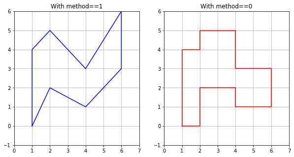
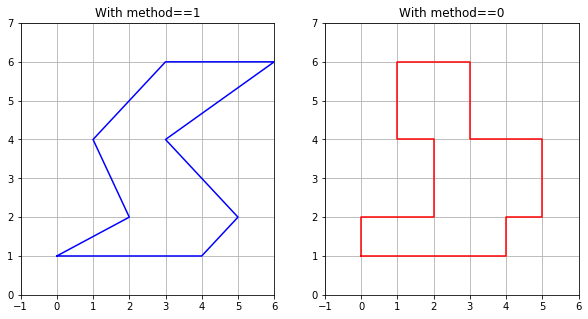
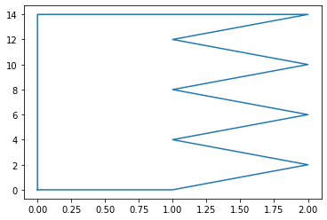
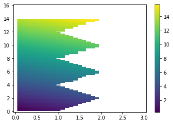
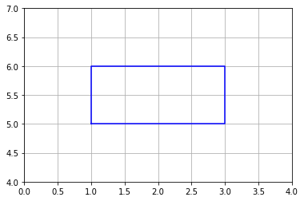
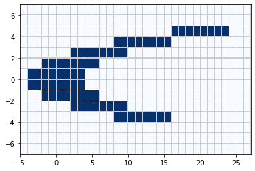
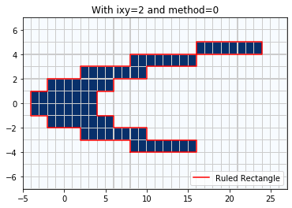
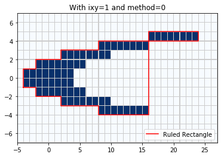
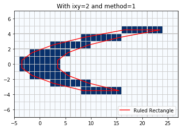

.. _ruled_rectangles:

Ruled Rectangles
================

**New in Version 5.7.0.**

Adapted from `this notebook
<http://www.clawpack.org/gallery/_static/apps/notebooks/amrclaw/RuledRectangles.html>`_.

In past versions of AMRClaw and GeoClaw, one could specify "refinement
regions" as rectangles over which a `minlevel` and `maxlevel` are
specified (perhaps over some time interval), as described in
:ref:`refinement-regions`.

Allowing only rectangles made it very easy to check each cell for
inclusion in a region, but is a severe restriction -- often a number of
rectangles must be used to follow a complicated coastline, for example,
or else many points ended up being refined that did not require it (e.g.
onshore points that never get wet in a GeoClaw simulation).

We have introduced a new data structure called a "Ruled Rectangle" that
is a special type of polygon for which it is also easy to check whether
a given point is inside or outside, but that is much more flexible than
a rectangle. It is a special case of a "ruled surface", which is a
surface in 3D that is bounded by two curves, each parameterized by
:math:`s` from :math:`s_1` to :math:`s_2`, and with the surface defined
as the union of all the line segments connecting one curve to the other
for each value of :math:`s` in :math:`[s_1,s_2]`. A Ruled Rectangle is a
special case in which each curve lies in the :math:`x`-:math:`y` plane
and either :math:`s=x` for some range of :math:`x` values or :math:`s=y`
for some range of :math:`y` values. If :math:`s=x`, for example, then
the line segments defining the surface are intervals
:math:`y_{\scriptstyle lower}(x) \leq y \leq y_{\scriptstyle upper}(x)`
for each :math:`x` over some range :math:`x_1 \leq x \leq x_2`. It is
easy to check if a given :math:`(x_c,y_c)` is in this region: it is if
:math:`x_1 \leq x_c \leq x_2` and in addition
:math:`y_{\scriptstyle lower}(x_c) \leq y_c \leq y_{\scriptstyle upper}(x_c)`.

The class ``clawpack.amrclaw.region_tools.RuledRectangle`` supports
a subset of ruled rectangles defined by a finite set of :math:`s`
values along a coordinate line, e.g. :math:`s[0] < s[1] < s[2] <
\cdots < s[N]` and for each :math:`s[k]` two values `lower[k]` and
`upper[k]`. If `rr` is an instance of this class then `rr.s`,
`rr.lower`, and `rr.upper` contain these arrays. Whether `s`
corresponds to `x` or `y` is determined by:

-  If `rr.ixy in [1, 'x']` then `s` gives a set of :math:`x` values,
-  If `rr.ixy in [2, 'y']` then `s` gives a set of :math:`y` values.

The points specified can then be connected by line segments to define a
Ruled Rectangle, and this is done if `rr.method == 1` (piecewise
linear). On the other hand, if `rr.method == 0` (piecewise constant)
then the values `lower[k], upper[k]` are used as the bounds for all
`s` in the interval :math:`s[k] \leq s \leq s[k+1]` (for
:math:`k = 0,~1,~\ldots,~N-1`). In this case the values
`lower[N], upper[N]` are not used. This also defines a polygon, but
one that consists of a set of *stacked boxes*. The advantage of the
latter form is that it is slightly easier to check if a point is in the
Ruled Rectangle since no linear interpolation is required along the
edges. Also for some applications we want the Ruled Rectangle to exactly
cover a contiguous set of finite volume grid cells, which has the shape
of a set of stacked boxes.

Contents
--------

-  `Examples <#rr-examples>`__
-  `Relation to convex polygons <#rr-polygons>`__
-  `Other attributes and methods <#rr-attr>`__
-  `A simple rectangle <#rr-rect>`__
-  `Defining a Ruled Rectangle covering selected cells <#rr-cover>`__

.. _rr-examples:

Examples
--------

Some simple examples follow:

Define a Ruled Rectangle by specifying a set of points:

.. code:: ipython3

    from clawpack.amrclaw import region_tools
    rr = region_tools.RuledRectangle()
    rr.ixy = 1  # so s refers to x, lower & upper are limits in y
    rr.s = array([1,2,4,6])
    rr.lower = array([0,2,1,3])
    rr.upper = array([4,5,3,6])

Setting `rr.method` to 1 or 0 gives a Ruled Rectangle in which the
points specified above are connected by lines or used to define stacked
boxes.

Both are illustrated in the figure below. Note that we use the method
`rr.vertices()` to return a list of all the vertices of the polygon
defined by `rr` for plotting purposes.

.. code:: ipython3

    figure(figsize=(10,5))
    subplot(121)
    rr.method = 1
    xv,yv = rr.vertices()
    plot(xv,yv,'b')
    grid(True)
    axis([0,7,-1,6])
    title('With method==1')
    
    subplot(122)
    rr.method = 0
    xv,yv = rr.vertices()
    plot(xv,yv,'r')
    grid(True)
    axis([0,7,-1,6])
    title('With method==0')

In the plots above the `s` values correspond to `x = 1, 2, 4, 6`,
and the `lower` and `upper` arrays define ranges in `y`.

If we set `rr.ixy = 2` or `'y'`, then the `s` values will instead
correspond to `y = 1, 2, 4, 6` and the `lower` and `upper` will
define ranges in `x`. This is illustrated in the plots below.

.. code:: ipython3

    rr.ixy = 2  # so s refers to y, lower & upper are limits in x
    
    figure(figsize=(10,5))
    subplot(121)
    rr.method = 1
    xv,yv = rr.vertices()
    plot(xv,yv,'b')
    grid(True)
    axis([-1,6,0,7])
    title('With method==1')
    
    subplot(122)
    rr.method = 0
    xv,yv = rr.vertices()
    plot(xv,yv,'r')
    grid(True)
    axis([-1,6,0,7])
    title('With method==0')

.. _rr-polygons:

Relation to convex polygons
---------------------------

Note that the polygons above are not convex, but clearly some Ruled
Rectangles would be convex. Conversely, *any* convex polygon can be
expressed as a Ruled Rectangle --- simply order the vertices so that the
:math:`x` values are increasing, for example, and use these as the `s`
values in a `RuledRectangle` with `ixy='x'`. Then for each :math:`x`
there is a connected interval of :math:`y` values that lie within the
polygon (by convexity), so this defines the `lower` and `upper`
values. (Or you could start by ordering vertices by increasing :math:`y`
values and similarly define a `RuledRectangle` with `ixy='y'`.)

So a `RuledRectangle` is a nice generalization of a convex polygon for
which it is easy to check inclusion of an arbitrary point.

.. _rr-attr:

Other attributes and methods
----------------------------

`ds`
~~~~~~

If the points `s[k]` are equally spaced then `ds` is the spacing
between them. This makes it quicker to determine what two points an
arbitrary value of :math:`s` lies between when determining whether a
large set of points are inside or outside the Ruled Rectangle, rather
than having to search.

The Ruled Rectangle defined above has unequally spaced points and the
`ds` attribute is set to `-1` in this case.

.. code:: ipython3

    rr.ds

.. parsed-literal::

    -1

`slu`
~~~~~~~

Rather than specifying `s`, `lower`, and `upper` separately, you
can specify an array `slu` with three columns in defining a
`RuledRectangle`, and such an array is returned by the `slu` method:

.. code:: ipython3

    rr.slu()

.. parsed-literal::

    array([[1, 0, 4],
           [2, 2, 5],
           [4, 1, 3],
           [6, 3, 6]])

Here's an example defining a `RuledRectangle` via `slu`:

.. code:: ipython3

    slu = vstack((linspace(0,14,8), zeros(8), [1,2,1,2,1,2,1,2])).T
    print('slu = \n', slu)
    
    rr = region_tools.RuledRectangle(slu=slu)
    rr.ixy = 2
    rr.method = 1
    xv,yv = rr.vertices()
    plot(xv,yv)

.. parsed-literal::

    slu = 
     [[ 0.  0.  1.]
     [ 2.  0.  2.]
     [ 4.  0.  1.]
     [ 6.  0.  2.]
     [ 8.  0.  1.]
     [10.  0.  2.]
     [12.  0.  1.]
     [14.  0.  2.]]

`bounding_box`
~~~~~~~~~~~~~~~~

`rr.bounding_box()` returns the smallest rectangle `[x1,x2,y1,y2]`
containing the ruled rectangle:

.. code:: ipython3

    rr.bounding_box()

.. parsed-literal::

    [0.0, 2.0, 0.0, 14.0]

`mask_outside`
~~~~~~~~~~~~~~~~

If `X,Y` are 2D numpy arrays defining `(x,y)` coordinates on a grid,
then `rr.mask_outside(X,Y)` returns a mask array `M` of the same
shape as `X,Y` that is `True` at points outside the Ruled Rectangle.

.. code:: ipython3

    x = linspace(0,3,31)
    y = linspace(0,16,81)
    X,Y = meshgrid(x,y)
    Z = X + Y # sample data values to plot
    
    M = rr.mask_outside(X,Y)
    Zm = ma.masked_array(Z,mask=M)
    pcolorcells(X,Y,Zm)
    colorbar()

read and write, and instantiating from a file
~~~~~~~~~~~~~~~~~~~~~~~~~~~~~~~~~~~~~~~~~~~~~

`rr.write(fname)` writes out the `slu` array and other attributes to
file `fname`, and `rr.read(fname)` can be used to read in such a
file. You can also specify `fname` when instantiating a new Ruled
Rectangle:

.. code:: ipython3

    rr.write('RRzigzag.data')

.. code:: ipython3

    rr2 = region_tools.RuledRectangle('RRzigzag.data')
    rr2.slu()

.. parsed-literal::

    array([[ 0.,  0.,  1.],
           [ 2.,  0.,  2.],
           [ 4.,  0.,  1.],
           [ 6.,  0.,  2.],
           [ 8.,  0.,  1.],
           [10.,  0.,  2.],
           [12.,  0.,  1.],
           [14.,  0.,  2.]])

Here's what the file looks like:

.. code:: ipython3

    lines = open('RRzigzag.data').readlines()
    for line in lines: 
        print(line.strip())

.. parsed-literal::

    
    2   ixy
    1   method
    2    ds
    8    nrules
    0.000000000   0.000000000   1.000000000
    2.000000000   0.000000000   2.000000000
    4.000000000   0.000000000   1.000000000
    6.000000000   0.000000000   2.000000000
    8.000000000   0.000000000   1.000000000
    10.000000000   0.000000000   2.000000000
    12.000000000   0.000000000   1.000000000
    14.000000000   0.000000000   2.000000000

Note that this Ruled Rectangle has equally spaced points and so
`ds = 2` is the spacing.

`make_kml`
~~~~~~~~~~~~

`rr.make_kml()` can be used to create a kml file that can be opened on
Google Earth to show the polygon defined by `rr`. This assumes that
`x` corresponds to longitude and `y` to latitude and is designed for
GeoClaw applications. Several optional arguments can be specified:
`fname, name, color, width, verbose`.

A GeoClaw AMR flag region
~~~~~~~~~~~~~~~~~~~~~~~~~

The figure below shows a Ruled Rectangle designed to cover Admiralty
Inlet, the water way between the Kitsap Peninsula and Whidbey Island
connecting the Strait of Juan de Fuca to lower Puget Sound. For some
tsunami modeling problems it is important to cover this region with a
finer grid than is needed elsewhere.

.. code:: ipython3

    Image('figs/RuledRectangle_AdmiraltyInlet.png', width=400)

.. image:: RuledRectangles_files/RuledRectangles_32_0.png
   :width: 400px

The Ruled Rectangle shown above was defined by the code below:

.. code:: ipython3

    slu = \
    array([[  47.851, -122.75 , -122.300],
           [  47.955, -122.75 , -122.300],
           [  48.   , -122.8  , -122.529],
           [  48.036, -122.8  , -122.578],
           [  48.12 , -122.9  , -122.577],
           [  48.187, -122.9  , -122.623],
           [  48.191, -122.9  , -122.684],
           [  48.221, -122.9  , -122.755]])
           
    rr_admiralty = region_tools.RuledRectangle(slu=slu)
    rr_admiralty.ixy = 'y'
    rr_admiralty.method = 1
    
    rr_name = 'RuledRectangle_AdmiraltyInlet'
    rr_admiralty.write(rr_name + '.data')
    rr_admiralty.make_kml(fname=rr_name+'.kml', name=rr_name)

The file `RuledRectangle_AdmiraltyInlet.data` can then be used as a
"flag region" in the modified GeoClaw code, see
`FlagRegions.ipynb <FlagRegions.ipynb>`__ for more details.

The file `RuledRectangle_AdmiraltyInlet.kml` can be opened in Google
Earth to show the polygon, as captured in the figure above.

.. _rr-rect:

A simple rectangle
------------------

A simple rectangle with extent `[x1,x2,y1,y2]` can be specified as a
`RuledRectangle` via e.g. :

::

    rectangle = region_tools.RuledRectangle()
    rectangle.ixy = 'x'
    rectangle.s = [x1, x2]
    rectangle.lower = [y1, y1]
    rectangle.upper = [y2, y2]
    rectangle.method = 0

This can be done for you when instantiating a `RuledRectangle` using:

::

    rectangle = region_tools.RuledRectangle(rect=[x1,x2,y1,y2])

For example:

.. code:: ipython3

    rectangle = region_tools.RuledRectangle(rect=[1,3,5,6])
    
    xv,yv = rectangle.vertices()
    plot(xv,yv,'b')
    grid(True)
    axis([0,4,4,7]);

.. _rr-cover:

Defining a Ruled Rectangle covering selected cells
--------------------------------------------------

The module function
``region_tools.ruledrectangle_covering_selected_points`` can be used to
generate a Ruled Rectangle that covers a specified set of points as
compactly as possible. This is useful for generating AMR refinement
regions that cover a set of points where we want to enforce a fine grid
without including too many other points.

First generate some sample data:

.. code:: ipython3

    x_edge = linspace(-5,27,33)
    y_edge = linspace(-7,7,15)
    
    x_center = 0.5*(x_edge[:-1] + x_edge[1:])
    y_center = 0.5*(y_edge[:-1] + y_edge[1:])
    
    X,Y = meshgrid(x_center,y_center)
    pts_chosen = where(abs(X-Y**2) < 4., 1, 0)
    pts_chosen = where(logical_or(X>24, Y<-4), 0, pts_chosen)
    pcolorcells(x_edge,y_edge,pts_chosen, cmap=cm.Blues, 
               edgecolor=[.8,.8,.8], linewidth=0.1)

The array `pts_chosen` has been defined with the value 1 in the dark
blue cells in the figure above, and 0 elsewhere.

In this case the points can be covered by a Ruled Rectangle with
`ixy = 'y'` most efficiently, giving a polygon that covers only the
selected points. Note we use `method = 0` to generate a Ruled
Rectangle that covers all the grid cells:

.. code:: ipython3

    rr = region_tools.ruledrectangle_covering_selected_points(x_center, y_center,
                                                              pts_chosen, ixy='y', method=0,
                                                              verbose=True)
    
    pcolorcells(x_edge,y_edge,pts_chosen, cmap=cm.Blues,
               edgecolor=[.8,.8,.8], linewidth=0.1)
    xv,yv = rr.vertices()
    plot(xv,yv,'r',label='Ruled Rectangle')
    legend(loc='lower right')
    title('With ixy=2 and method=0');

.. parsed-literal::

    Extending rectangles to cover grid cells
    RuledRectangle covers 80 grid points

By contrast, if we use `ixy = 'x'`, the minimal Ruled Rectangle
covering the selected cells will also cover a number of cells that were
not selected:

.. code:: ipython3

    rr = region_tools.ruledrectangle_covering_selected_points(x_center, y_center,
                                                              pts_chosen, ixy='x', method=0,
                                                              verbose=True)
    pcolorcells(x_edge,y_edge,pts_chosen, cmap=cm.Blues,
               edgecolor=[.8,.8,.8], linewidth=0.1)
    xv,yv = rr.vertices()
    plot(xv,yv,'r',label='Ruled Rectangle')
    legend(loc='lower right')
    title('With ixy=1 and method=0');

.. parsed-literal::

    Extending rectangles to cover grid cells
    RuledRectangle covers 129 grid points

Note that if we use `method = 1` then the Ruled Rectangle covers the
center of each cell but not the entire grid cell for cells near the
boundary:

.. code:: ipython3

    rr = region_tools.ruledrectangle_covering_selected_points(x_center, y_center,
                                                              pts_chosen, ixy='y', method=1,
                                                              verbose=True)
    
    pcolorcells(x_edge,y_edge,pts_chosen, cmap=cm.Blues,
               edgecolor=[.8,.8,.8], linewidth=0.1)
    xv,yv = rr.vertices()
    plot(xv,yv,'r',label='Ruled Rectangle')
    legend(loc='lower right')
    title('With ixy=2 and method=1');

.. parsed-literal::

    RuledRectangle covers 63 grid points

With `ixy='x'` and `method=1` the Ruled Rectangle degenerates in the
upper right corner to a line segment that covers only the cell centers:

.. code:: ipython3

    rr = region_tools.ruledrectangle_covering_selected_points(x_center, y_center,
                                                              pts_chosen, ixy='x', method=1,
                                                              verbose=True)
    pcolorcells(x_edge,y_edge,pts_chosen, cmap=cm.Blues,
               edgecolor=[.8,.8,.8], linewidth=0.1)
    xv,yv = rr.vertices()
    plot(xv,yv,'r',label='Ruled Rectangle')
    legend(loc='lower right')
    title('With ixy=1 and method=1');

.. parsed-literal::

    RuledRectangle covers 100 grid points

.. image:: RuledRectangles_files/RuledRectangles_48_1.png

Example covering the continental shelf
~~~~~~~~~~~~~~~~~~~~~~~~~~~~~~~~~~~~~~

The figure below shows a Ruled Rectangle that roughly covers the
continental shelf offshore of Vancouver Island and Washington state. The
region may need to be refined to a higher level than the deeper ocean in
order to capture shoaling tsunami waves interacting with the shelf
topography. This region was defined by first selecting a set of points
from etopo1 topography satisfying certain constraints on elevation using
the marching front algorithm described in :ref:`marching_front`,
and then using the ``region_tools.ruledrectangle_covering_selected_points``
function to build a Ruled Rectangle covering these points.

.. image:: RuledRectangles_files/RuledRectangles_50_0.png
   :width: 400px

